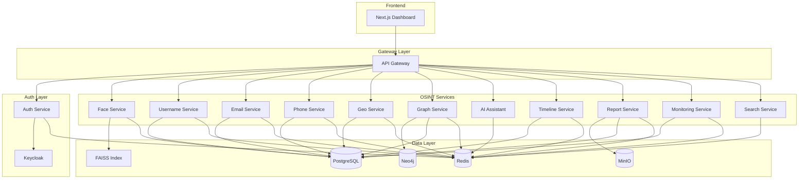

# DeepTrace OSINT Platform

[](https://deeptrace.app)
[](LICENSE)

Advanced OSINT investigation platform combining facial recognition, username hunting, email intelligence, and social graph analysis.

## Features

| Module | Description | Status |
|--------|-------------|--------|
|  | AI-powered facial recognition with FAISS vector search |  |
|  | Maigret integration for 2000+ site searches |  |
|  | Breach lookup via HIBP, Gravatar, GitHub searches |  |
|  | Carrier lookup, WhatsApp/Telegram detection |  |
|  | EXIF extraction, OCR, reverse geocoding |  |
|  | Neo4j-powered relationship mapping |  |
|  | Ollama streaming chat for investigation summaries |  |
|  | Wayback Machine integration, event reconstruction |  |
|  | PDF/CSV/JSON export with templated layouts |  |
|  | Scheduled breach scans, webhook alerts |  |
|  | Keycloak integration with RBAC |  |
|  | API gateway with rate limiting |  |
|  | Multi-source investigation aggregation |  |
|  | Next.js frontend with real-time updates |  |

## Tech Stack


## Quick Start

```bash
docker compose up -d
```

The platform will be available at `http://localhost:3000`

## Architecture



## Services

| Service | Port | Description |
|---------|------|-------------|
| gateway | 8080 | API Gateway with rate limiting and routing |
| auth | 8001 | Authentication service with Keycloak integration |
| face | 8002 | Facial recognition with FAISS vector search |
| username | 8003 | Username hunting across 2000+ platforms |
| email | 8004 | Email breach lookup and exposure intelligence |
| phone | 8005 | Phone number carrier and social detection |
| geo | 8006 | Geo intelligence with EXIF and OCR analysis |
| graph | 8007 | Social graph engine with Neo4j traversal |
| timeline | 8008 | Timeline reconstruction with Wayback integration |
| ai | 8009 | AI assistant with Ollama streaming chat |
| report | 8010 | Report generation with PDF export |
| monitoring | 8011 | Alert service with scheduled checks |
| search | 8012 | Investigation aggregation and search |
| frontend | 3000 | Next.js dashboard |

## Environment Variables

### Core Configuration

| Variable | Description | Default |
|----------|-------------|---------|
| `COMPOSE_PROJECT_NAME` | Docker project name | `deeptrace` |
| `DOMAIN` | Application domain | `localhost` |
| `ENVIRONMENT` | Deployment environment | `development` |

### Database & Storage

| Variable | Description | Default |
|----------|-------------|---------|
| `POSTGRES_HOST` | PostgreSQL host | `postgres` |
| `POSTGRES_PORT` | PostgreSQL port | `5432` |
| `POSTGRES_DB` | PostgreSQL database | `deeptrace` |
| `POSTGRES_USER` | PostgreSQL user | `deeptrace` |
| `POSTGRES_PASSWORD` | PostgreSQL password | `deeptrace` |
| `REDIS_HOST` | Redis host | `redis` |
| `REDIS_PORT` | Redis port | `6379` |
| `NEO4J_URI` | Neo4j Bolt URI | `bolt://neo4j:7688` |
| `NEO4J_USER` | Neo4j username | `neo4j` |
| `NEO4J_PASSWORD` | Neo4j password | `deeptrace` |
| `MINIO_ENDPOINT` | MinIO endpoint | `minio:9000` |
| `MINIO_ACCESS_KEY` | MinIO access key | `minioadmin` |
| `MINIO_SECRET_KEY` | MinIO secret key | `minioadmin` |

### External APIs

| Variable | Description | Required |
|----------|-------------|----------|
| `HIBP_API_KEY` | HaveIBeenPwned API key | Yes |
| `KEYCLOAK_ADMIN` | Keycloak admin username | Yes |
| `KEYCLOAK_PASSWORD` | Keycloak admin password | Yes |
| `OLLAMA_BASE_URL` | Ollama service URL | Optional |

## Default Credentials

| Service | Username | Password |
|---------|----------|----------|
| Keycloak Admin | `admin` | `admin` |
| PostgreSQL | `deeptrace` | `deeptrace` |
| MinIO | `minioadmin` | `minioadmin` |
| Neo4j | `neo4j` | `deeptrace` |

> **⚠️ Security Warning:** Change all default passwords before production deployment.

## Development Setup

```bash
# Clone the repository
git clone https://github.com/deeptrace/deeptrace.git
cd deeptrace

# Start development environment
docker compose up -d

# View logs
docker compose logs -f

# Run tests
docker compose exec gateway pytest
docker compose exec frontend npm test
```

### Service Development

Each service can be developed independently:

```bash
# Backend service (example: auth)
cd services/auth
python -m venv .venv
source .venv/bin/activate
pip install -e ".[dev]"
uvicorn app.main:app --reload

# Frontend
cd apps/web
npm install
npm run dev
```

## Production Deployment

```bash
# Create production environment file
cp .env.example .env.prod

# Edit with production values
nano .env.prod

# Deploy with production configuration
docker compose -f docker-compose.yml -f docker-compose.prod.yml up -d
```

See [Deployment Guide](docs/deployment.md) for detailed production setup.

## Troubleshooting

- **Services not starting**: Check `docker compose logs <service>`
- **Database connection errors**: Verify PostgreSQL and Redis are running
- **Authentication issues**: Ensure Keycloak realm is configured
- **FAISS errors**: Check `/data/faiss.index` permissions
- **Full troubleshooting guide**: [docs/troubleshooting.md](docs/troubleshooting.md)

## Contributing

1. Fork the repository
2. Create a feature branch (`git checkout -b feature/amazing-feature`)
3. Commit your changes (`git commit -m 'Add amazing feature'`)
4. Push to the branch (`git push origin feature/amazing-feature`)
5. Open a Pull Request

Please read our [Contributing Guidelines](CONTRIBUTING.md) for details.

## License

This project is licensed under the MIT License - see the [LICENSE](LICENSE) file for details.